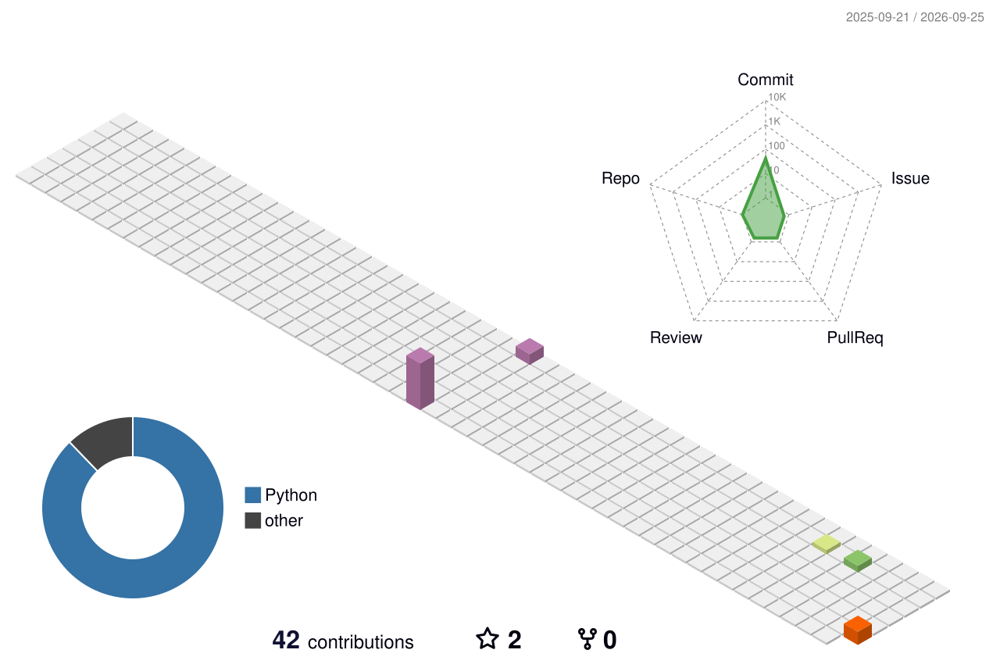

 

 

## 👋 About Me

- 🔍 **SDK QA팀 · 인증 파트**에서 회원가입·로그인 기능을 검증하고 있어요
- 📝 테스트 케이스(TC) 설계부터 검증까지 직접 수행해요
- 🤖 요즘은 Playwright 기반 테스트 자동화를 공부하고 있어요
- 🎮 게임을 좋아해서, 취미로 게임을 더 편하게 즐길 수 있는 외부 플러그인을 만들어요

 

## 🎮 Featured Project

<table>
<tr>
<td>

### [📅 Daily-Game-Check-in](https://github.com/skt4253/Daily-Game-Check-in)

> 컴퓨터와 출석체크 앱조차 켜기 귀찮은 사람들을 위한 스크립트

원신 · 붕괴: 스타레일 · 젠레스 존 제로(HoYoLAB)와 명일방주: 엔드필드(SKPORT)의 출석체크를  
**매일 새벽 자동으로 실행하고, 결과를 텔레그램으로 알려줍니다.**

- ⏰ GitHub Actions 스케줄로 서버 없이 매일 자동 실행
- 🔄 엔드필드 토큰이 만료되면 자동으로 갱신한 뒤 다시 시도
- 🧾 응답 코드별로 결과를 구분 (출석 완료 / 이미 출석 / 쿠키 만료 등)
- 📱 텔레그램 봇으로 게임별 결과를 한 번에 전송

</td>
</tr>
</table>

 

## 🗓️ Timeline

| 기간 | 소속 | 내용 |
|:---:|:---|:---|
| **2026.04 ~** | 🔐 SDK QA팀 · 인증 파트 | 회원가입·로그인 QA, TC 설계 |
| **2025.10 ~ 2026.03** | 🌐 웹 QA팀 · MARBLEX 파트 | 웹 서비스 QA |
| **2025.07 ~ 2025.10** | 🌱 웹 QA팀 인턴 · MARBLEX 파트 | 웹 서비스 QA |
| **2023 ~ 2024** | 💡 IT 사업 아이템 | 서비스 개발 및 PM |
| **2019 ~ 2023** | 🎓 순천향대학교 | 사물인터넷학과 |

 

## 🧪 QA Tools

**Issue & Docs** 

**API & Network** 

**Mobile** 

**Etc** 

 

## 🛠️ Dev

**Languages & Frameworks** 

 

**IoT** 

**Database** 

**Tools** 

 

## 🕹️ Now Playing

 

 

## 🔥 Stats

 

<picture>
  <source media="(prefers-color-scheme: dark)" srcset="./profile-3d-contrib/profile-night-rainbow.svg" />
  
</picture>

